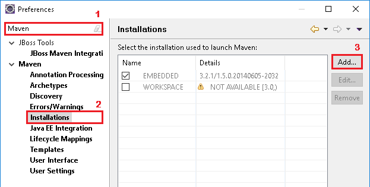
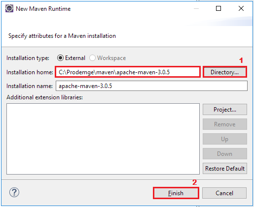
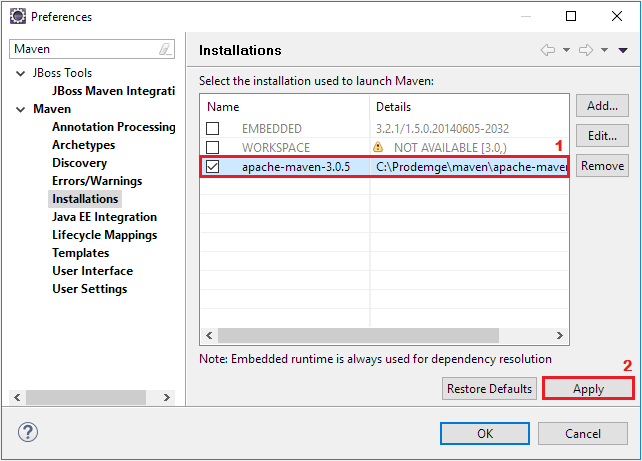
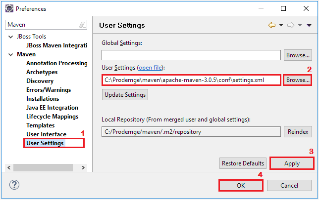
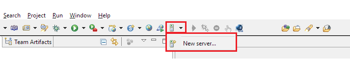
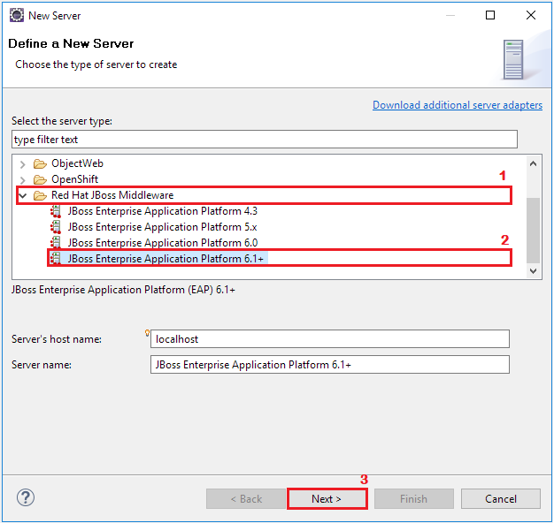
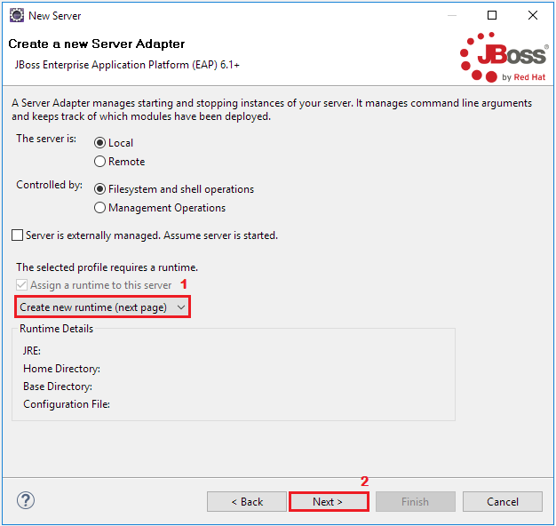
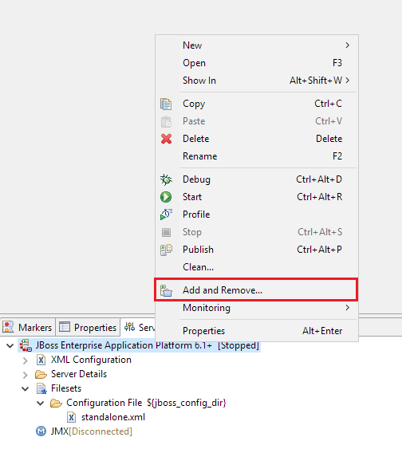
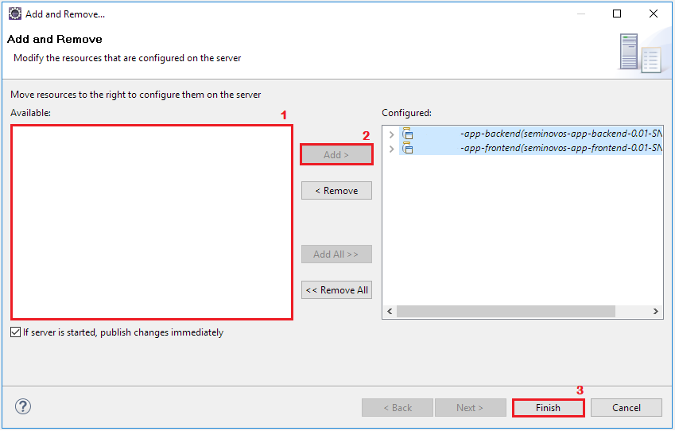

# Configurando o Ambiente de Desenvolvimento

1. [Maven](#maven)
    - [Configurando a Instalação](#configurando-a-instalação)
    - [Setando o Arquivo de Configuração (XML)](#setando-o-arquivo-de-configuração)
2. [JBoss (Servidor de Aplicação)](#jboss)
3. [PostgreSQL (Banco de Dados)](#)


## Maven

#### Configurando a Instalação

Na barra de menu superior do Eclipse Luna selecione `Window > Preferences`.  
No submenu `Maven > Installations` clique em `Add`.



No modal aberto, em `Installation Home` procure pelo diretório do Maven na pasta do Prodígio.  
_Como padrão em `C:\Prodemge\maven\apache-maven-x.x`._



Uma vez de volta no submenu `Installations` certifique-se de selecionar o runtime adicionado na etapa anterior.



#### Setando o Arquivo de Configuração

Na janela `Window > Preferences` selecione o submenu `Maven > User Settings`.  
No campo `User Settings` selecione o arquivo `settings.xml` no diretório do Maven disponibilizado na pasta do Prodígio.  
_Como padrão em `C:\Prodemge\maven\apache-maven-x.x\conf\settings.xml`_



## JBoss

#### Criando o Servidor

Na barra de ferramentas superior do Eclipse Luna seleciona `Server > New server`.



Na janela aberta selecione `Red Hat JBoss Middleware > JBoss Enterprise Application Platform 6.1+` e clique em `Next`.



Certifique-se de selecionar `Create new runtime (next page)` e clique em `Next`.



No campo `Home Directory` selecione o diretório do JBoss disponibilizado na pasta do Prodígio (_padrão `C:\Prodemge\servers\jboss-eap-6.4`_).  
Em `Runtime JRE` marque `Alternate JRE` e selecione o `jdk1.8.0_72` e clique em `Finish`. 

#### Configurando o Servidor e Conexões

Na view `Servers` do Eclipse Luna abra o arquivo de configuração do servidor em `Filesets > Configuration File > standalone.xml`.  
Na tag `datasource`, nos atributos `jndi-name` e `pool-name` troque "*NOMEAPLICACAO*" pelo nome da sua aplicação.  
Na tag `connection-url` troque "*NOMEBANCODEDADOS*" pelo nome que sera dado ao banco de dados.

```xml
...
<datasources>
	<datasource jta="false" jndi-name="java:/NOMEAPLICACAO-ds" pool-name="java:/NOMEAPLICACAO-ds" enabled="true" spy="false" use-ccm="false">
		<connection-url>jdbc:postgresql://localhost:5432/NOMEBANCODEDADOS</connection-url>
...
```

Salve o arquivo e o servidor estará devidamente configurado.

#### Adicionando o Projeto ao Servidor

**Nota:** para este passo é necessário ter [criado um projeto do Prodígio](#).

Na view `Servers` clique com o botâo direito no servidor JBoss e selecione `Add and Remove`.



Selecione os dois jars do projeto disponiveis em `Available`<sup>1</sup>, clique em `Add >`<sup>2</sup> e `Finish`<sup>3</sup>.



Agora em diante o projeto esta pronto para ser publicado. Selecione os jars na view `Servers` clique com o botão direito sobre eles e selecione `Full Publish`.  


