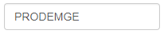
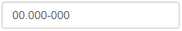
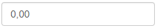
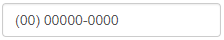
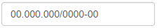

# Texboxbind



### Sobre

Este componente é uma caixa de edição utilizada para a manipulação de texto pelo usuário.

### Utilização



```java
<textboxbind nomeDoObjeto="classecontrole.objetoAtual.colecaoPersistida" />
```



```java
public class MinhaEntidadeVO extends TutorialBaseVO {
	...
	private String minhaPropriedade;

	public String getMinhaPropriedade() {
		return minhaPropriedade;
	}

	public void setMinhaPropriedade(String minhaPropriedade) {
		this.minhaPropriedade= minhaPropriedade;
	}
	...
	//Demais propriedades ocultadas para brevidade do exemplo
}
```




 Todos atributos e suas respectivas descrições podem ser visualizados no [sumário](untitled.md#sumario).


### Máscaras

| **Tag** | **Máscara** | **Tipo** | **Imagem** |
| --- | --- | --- | --- | --- | --- | --- |
| ` <cpfboxbind />` | CPF | String |  |
| ` <cepboxbind />` | CEP | String |  |
| ` <moneyboxbind />` | Moeda | BigDecimal |  |
| ` <telefoneboxbind />` | Telefone | String |  |
| `<cnpjboxbind />` | CNPJ | String |  |
| `<placaboxbind />` | Placa | String |  |

### Sumário

Atributos Principais

| **Atributo** | **Tipo** | **Descrição** |
| --- | --- | --- |
| `nomeDoObjeto` | String | Especifica o objeto que será vinculado ao componente.  |
| `id` | String | Alias para o nome do objeto. Apenas o nome da propriedade precisa ser especificado, sem a necessidade de especificar `classecontrole.objetoAtual`. Não sobrescreve `nomeDoObjeto`. |

Atributos Secundários

| **Atributo** |  **Tipo** | **Descrição** |
| --- | --- | --- | --- | --- | --- |
| `paste` | Boolean | Seta se o usuário pode colar no campo. Como padrão `true`. |
| `upper` | Boolean | Seta se o texto digitado será convertido para caixa alta. Como padrão `true`. |
| `somenteNumero` | Boolean | Filtra o campo para aceitar apenas caracteres numericos. Como padrão `false`. |
| `mask` | String | Define uma máscara para o campo. Use `S` para alfabéticos, `9` para numéricos opcionais, `0` para numéricos obrigatórios e `A` para alfanuméricos. Exemplo para placa: `SSS-0000`. |
|  |  |  |

